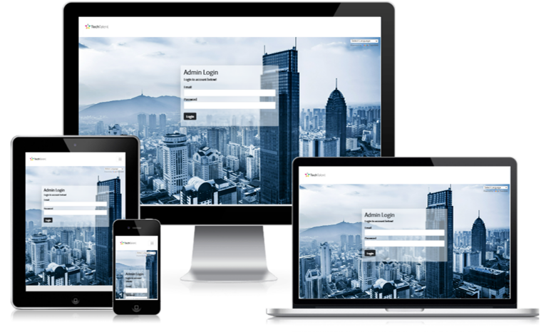

# Login-Application

* A sample layout of project work in different screen size

### Github Repository
- Refer to github over [here](https://github.com/xunne899/dxc-login-assign) for more details.

### Live Demo
- Link of live demo over [here](https://tech-talent-22.herokuapp.com/)

# Summary
A simple login application assignment on techtalent. Only managers are allowed to edit, add, delete staff profile. Normal users are only able to view staff profile without rights to edit, add, delete. Upon logging in, it will bring users to the staff profile welcome page.
Staff name, username, email and role will be shown on the staff profile page.
Validation error will be shown when there is an incorrect login.

* Users are able to change different languages based on their preferences. Langauge translate tool is located on the top right hand corner(just below navbar)
* When logged in, users are able to logout upon clicking the black logout tab (located top right hand corner of navbar)

## Technology Used 

- flash-sessions - using middleware display flash messsages
- csurf - Cross-Site Request Forgery (CSRF) protection
- wax-on - template inheritance using block, extend hbs
- handlebar-helpers - handlebar-helpers
- caolan forms - validate and create forms
- knex - MySQL Query builder
- CORS - share access, Cross-Origin Resource Sharing 
- doteenv - loading of environment variables
- db-migrate - migrate backend files
- bookshelf- backend SQL database ORM
- hbs - for backend file display
- SQL- backend database
- Express Node JS- Backend programming
- DB Beaver, postgress - store data after deployment
- React Boostrap 5.0 - accordian, cards, forms, col, rows 
- Heroku - hosting live for backend project
- Github & Gitpod - storing respositories/project

## Credits and Acknowledgement

[Techtalent](https://www.sunderlandsoftwarecity.com/event/tech-talent-2018/tech-talent-logo/)(web navbar logo) 
[Bootstrap](https://getbootstrap.com/docs/5.0/getting-started/introduction/)( web features)  
[createmockup](https://www.createmockup.com/generate/)(readme sample view layout) 
[freepik](https://www.freepik.com/)(background images) 
[Google Fonts](https://fonts.google.com/)(web font-family) 
[DB Beaver](https://dbeaver.io/)(store table data ) 
[Postgress](https://www.postgresql.org/)(store table data) 
[GitHub](https://github.com/)(storing of workspace) 
[GitPod](https://gitpod.io/workspaces)(storing of workspace) 
